

  

# FoodWise

Welcome to FoodWise, an innovative mobile application developed to revolutionize the way you manage your kitchen inventory and combat food waste. FoodWise is designed to empower users to make informed decisions about their food consumption, streamline meal planning, and contribute to a more sustainable future.

## Features

1. **Secure Login:** FoodWise offers a secure login screen where users can input their email to access their accounts safely.

    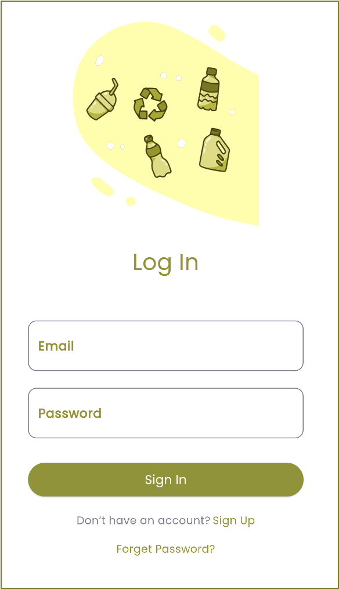

 

    

2. **Barcode Scanner:** With the barcode scanning feature, users can effortlessly add products to their inventory by scanning their barcodes. This ensures that associated products appear in their list of foods automatically.

    

 

    

3. **Calendar View:** FoodWise provides a calendar feature where users can view purchase dates and expiry dates of food items, enabling them to manage their inventory effectively.

    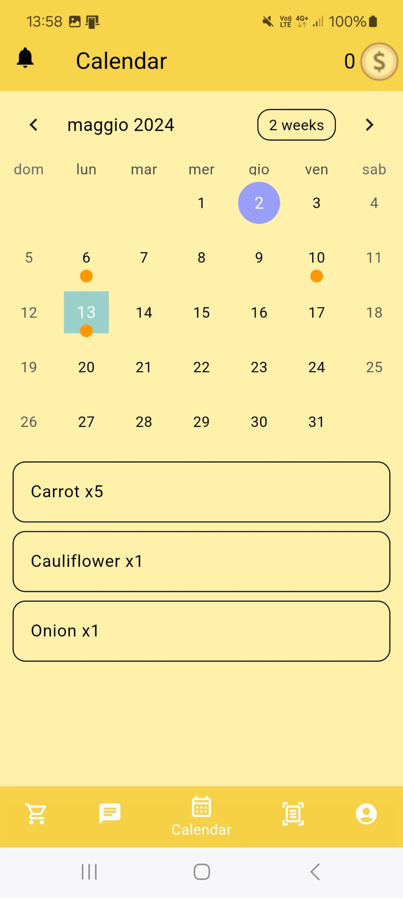

4. **Manual Input:** In addition to barcode scanning, users have the option to manually input food items into the app, ensuring that they can add items that couldn't be scanned.

    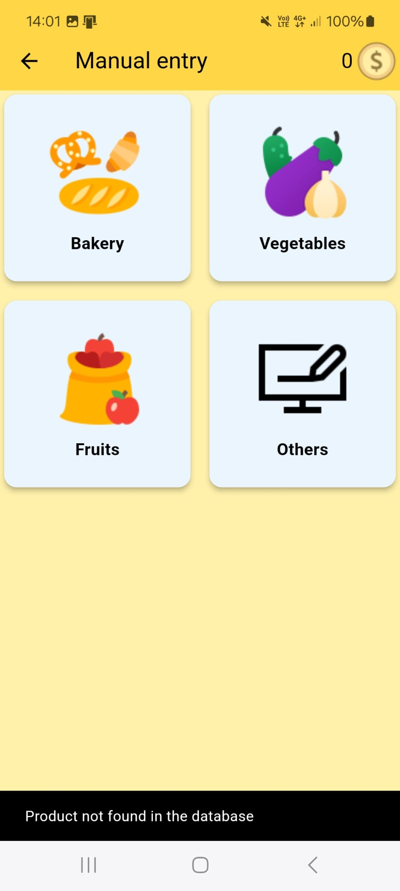

 

    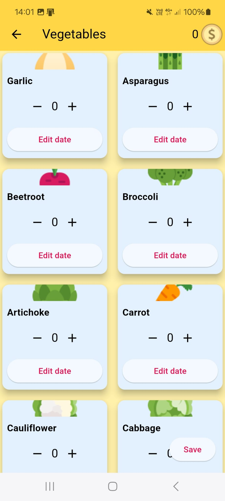

 

 
    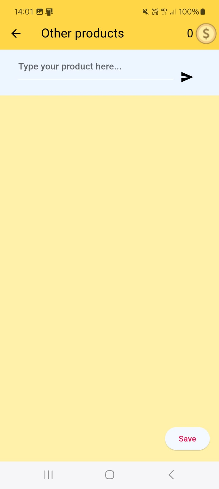

 

    

5. **Product Tracking and Search:** The product tracking feature enables users to efficiently manage and track items stored in their storage space. It provides a comprehensive overview of all products, categorized by their types, and allows users to search for specific items within their storage.

    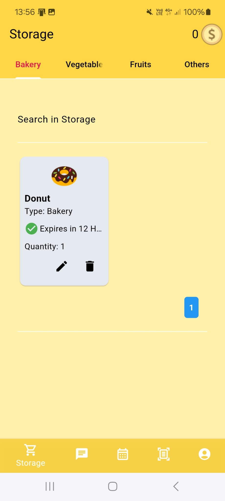

6. **AI Recipe Bot:** Bot that allows users to generate recipes based on the products a user has in storage and also based on their allergies.

    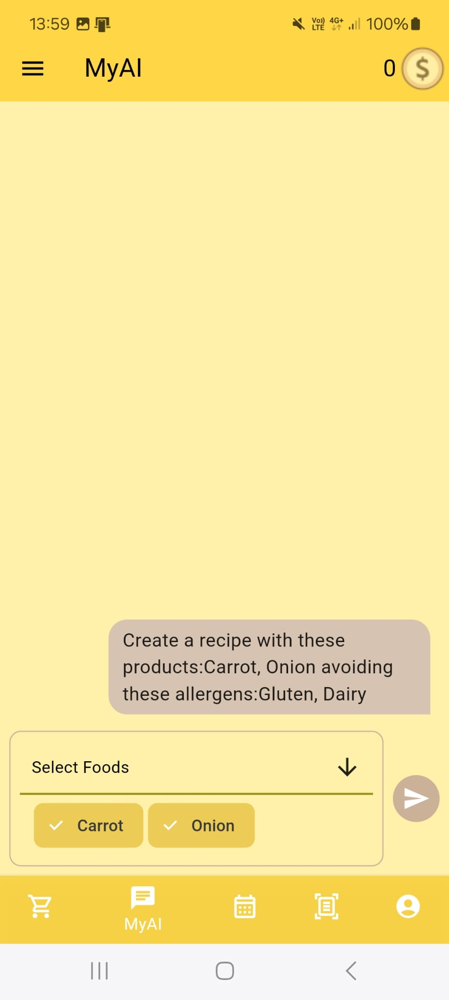

 

    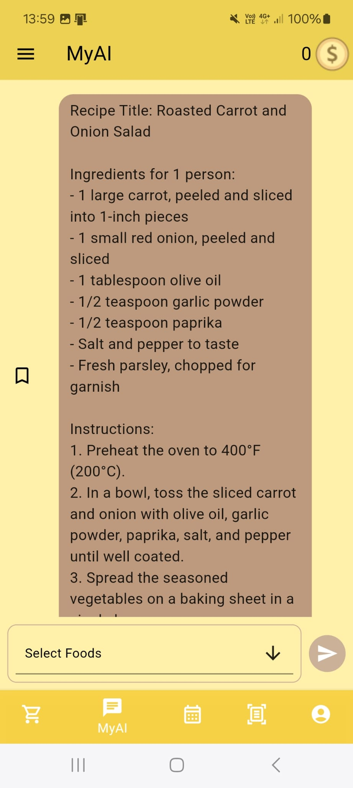

7. **Recipe Selection:** Users can select specific food items from their inventory to use in recipes, facilitating efficient meal planning.

    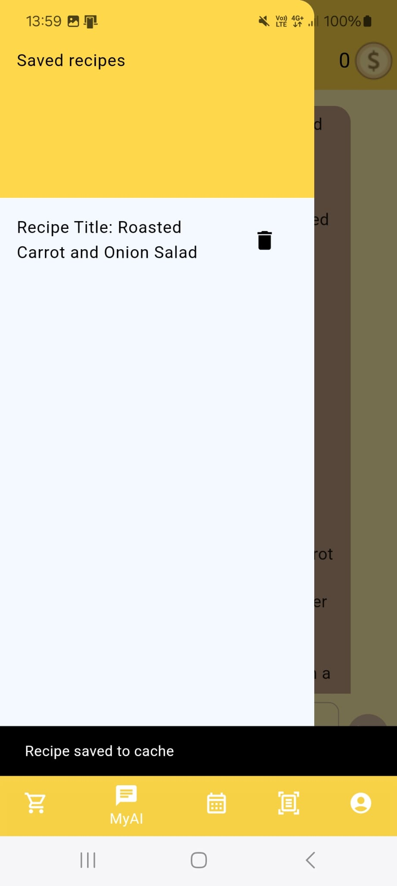

8. **Portion Size Adjustment:** The app allows users to change the portion size of a recipe, enabling them to adjust servings according to their needs and reduce waste.

    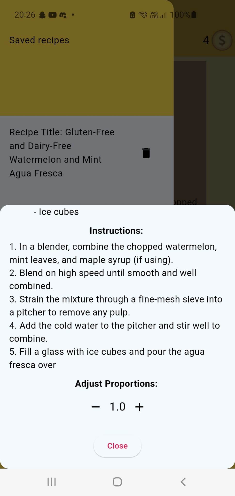

9. **Expiration Alerts:** FoodWise suggests foods that are close to expiration, helping users prioritize their use and minimize waste.

    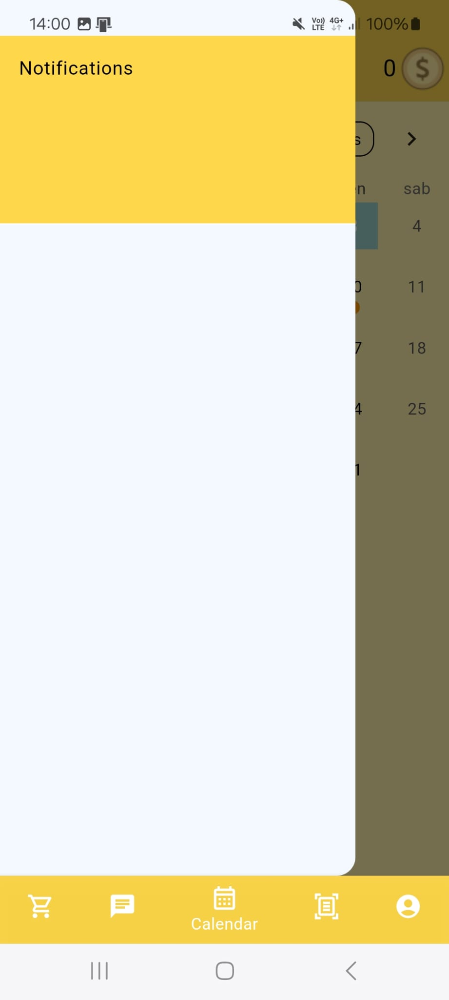

10. **User Account Information and Language Settings:** The user account information and language settings feature allow users to view and manage their account details within the app. Users can access their profile page to view personal information such as name, email, and score. Additionally, users have the ability to change the app's language according to their preference, enhancing accessibility and user experience.

    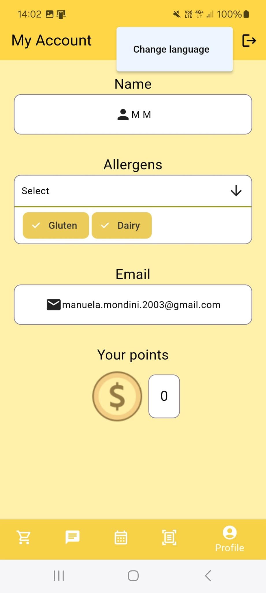

 

    

## Technology Used

- **Frontend:** Flutter for cross-platform mobile application development.
- **Backend:** Appwrite for backend services, providing authentication, database management, and other backend functionalities.

## Getting Started

## Authors
This project is developed as a collaboration between SUPSI and Penn State University.

SUPSI team members:

• **Pierpaolo Casati:** Technical Expert

• **Manuela Mondini:** Technical Expert 

Penn State University team members:

• **Arianna Parisi:** Project Manager

• **Ellie Bozo:** Technical Liaison

• **Joe Mast:** User Experience Manager

• **Kylie Benner:** Finance and Marketing Manager
